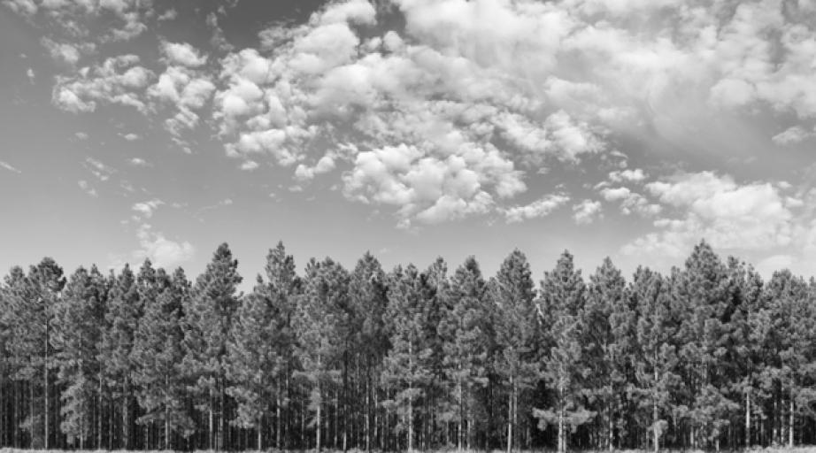

### Color transfer to grayscale images

This repo is an implementation of "A novel coloring framework for grayscale images" paper

#### Reference:

I. F. Jafar and G. M. AL Sukkar, "A novel coloring framework for grayscale images," 2010 International Conference on Multimedia Computing and Information Technology (MCIT), Sharjah, 2010, pp. 73-76, doi: 10.1109/MCIT.2010.5444849.

#### Examples 

  
 
 

  
 
 

##### &nbsp;&nbsp;&nbsp;&nbsp;&nbsp;&nbsp;&nbsp;&nbsp;&nbsp;&nbsp;&nbsp; &nbsp;&nbsp; &nbsp;&nbsp; &nbsp;&nbsp; (a) color_images &nbsp;&nbsp;&nbsp;&nbsp;&nbsp;&nbsp;&nbsp;&nbsp;&nbsp;&nbsp;&nbsp;&nbsp;&nbsp;&nbsp;&nbsp;&nbsp;&nbsp;&nbsp; &nbsp;&nbsp; &nbsp;&nbsp;&nbsp;&nbsp;&nbsp;&nbsp; &nbsp;&nbsp; (b) gray_images &nbsp;&nbsp;&nbsp;&nbsp;&nbsp;&nbsp;&nbsp;&nbsp;&nbsp;&nbsp;&nbsp;&nbsp;&nbsp;&nbsp;&nbsp;&nbsp;&nbsp;&nbsp;&nbsp;&nbsp;&nbsp;&nbsp;&nbsp;&nbsp;&nbsp;&nbsp;&nbsp; (c) colorized (b) 

